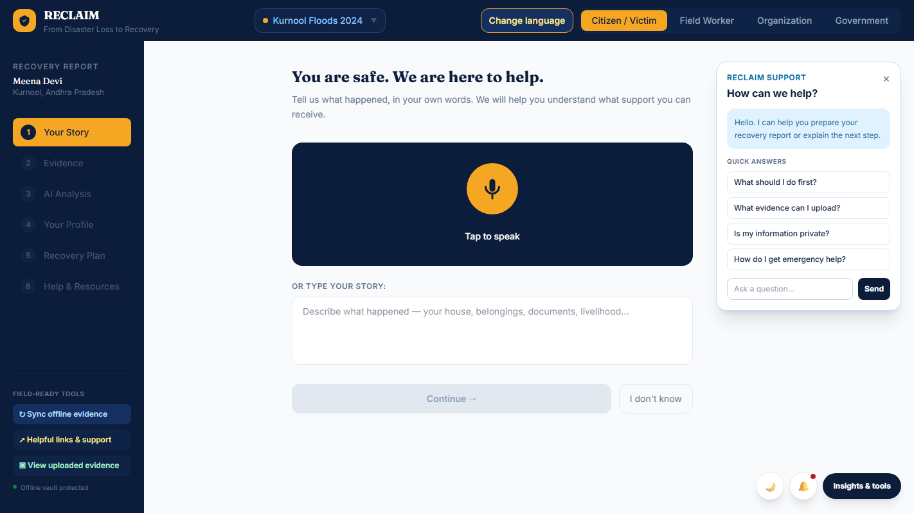
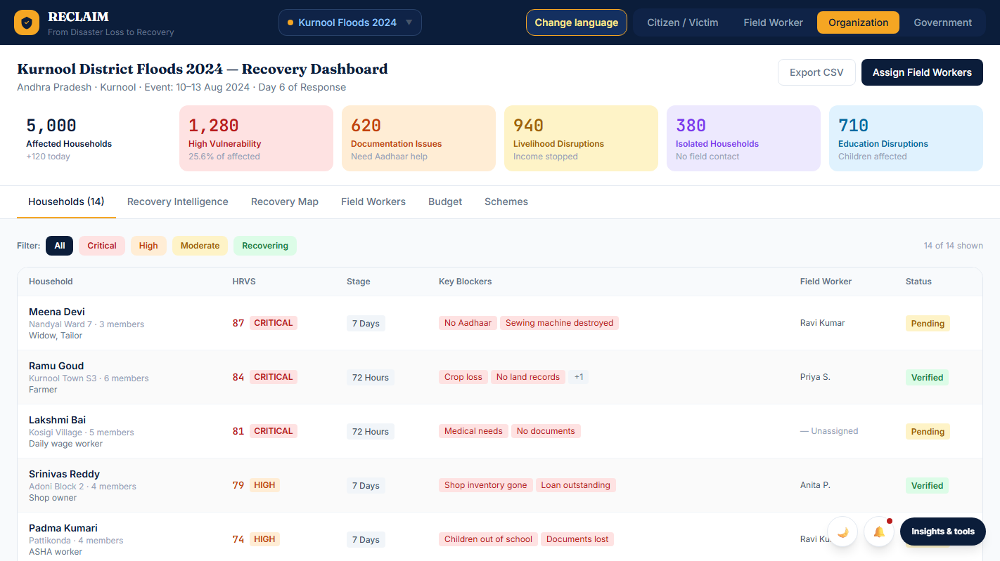

# RECLAIM

RECLAIM is a browser-based disaster recovery demo. It brings together a citizen reporting flow and sample dashboards for field workers, NGOs, and government teams.

The app does not send reports to a server. Its case details, dashboard figures, and analysis results are sample content. Please use fictional details in the demo; it is not ready to handle real survivor information or guide emergency or benefit decisions.

## Screenshots

**Citizen reporting**



**Organization dashboard**



## Run it locally

Use Node.js 22 and npm:

```bash
npm ci
npm run dev
```

Vite prints the local address. Before sharing a change, run:

```bash
npm run typecheck
npm run build
```

To preview the production build locally, run `npm run preview` after building.

## What is included

- A citizen flow for reporting damage, adding evidence, reviewing an analysis, and finding recovery resources.
- Separate screens for field workers, NGOs, and government teams.
- Sample disaster records and map views.
- Language and disaster selection, with the current selection reflected in the URL.

The analysis screen displays fixed sample results; it does not call an analysis service.

## Where things live

- `src/App.tsx` contains the app shell and navigation.
- `src/views/` contains the four role-based screens.
- `src/components/` contains shared UI, maps, and recovery tools.
- `src/data/disasters.ts` contains the sample disaster records.
- `src/i18n/strings.ts` contains the interface copy and translations.
- `docs/` contains the architecture notes, release checklist, and screenshots.

## GitHub Pages

The Actions workflows check pull requests and publish `main` to GitHub Pages. In the repository, go to **Settings → Pages** and choose **GitHub Actions** as the publishing source. After a successful deployment, the site should be available at:

https://bytesbysuyash.github.io/ReClaim/

Check the **Actions** tab for the workflow result and **Settings → Pages** for the published address.

## Data and external services

The app saves the selected language, theme, and recovery draft flag in browser storage. It loads fonts and translated text from Google and map tiles from OpenStreetMap. See [how the app is put together](docs/ARCHITECTURE.md) and the [release checklist](docs/RELEASE_CHECKLIST.md) before making changes for a public release.
